# Avalanche本地部署L1

参考资料：https://build.avax.network/docs/tooling/create-avalanche-l1

## 详细过程

1、安装最新版本的avalanche-cli
```
curl -sSfL https://raw.githubusercontent.com/ava-labs/avalanche-cli/main/scripts/install.sh | sh -s
```
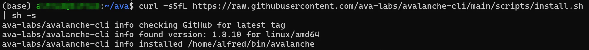

2、添加系统路径
```
export PATH=~/bin:$PATH
```
3、验证是否安装成功
```
avalanche -h
```
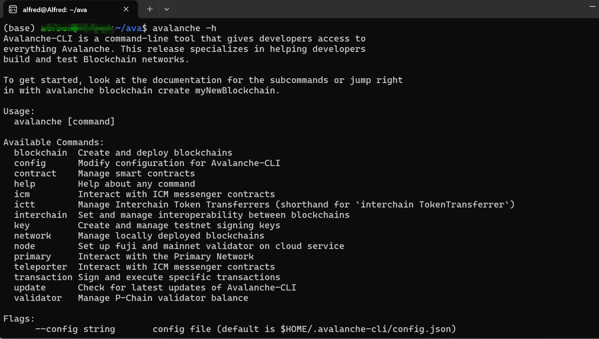

4、创建Avalanche L1配置，可以选择EVM或者其他可定制的VM
```
avalanche blockchain create [链名称]
```
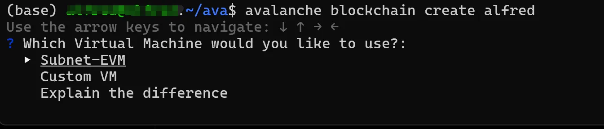
5、节点验证模式，Explain the difference可以诠释两者的区别
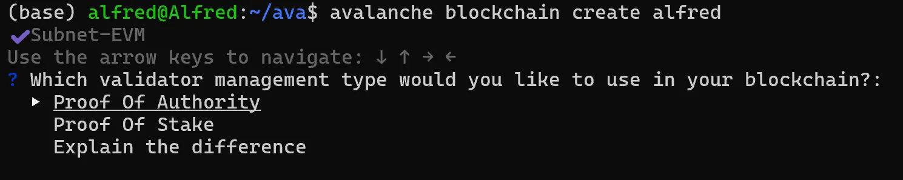
6、地址使用默认的，并且选择测试环境
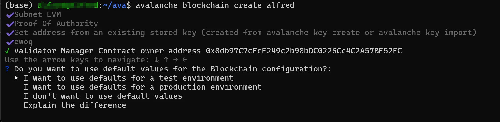
7、输入专属的Chain ID，可以通过chainlist官网查看Chain ID是否重复
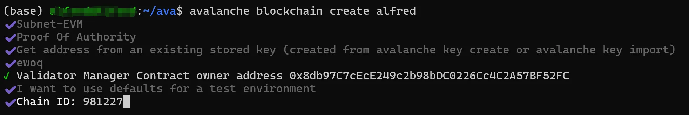
8、输入Token的代币名称
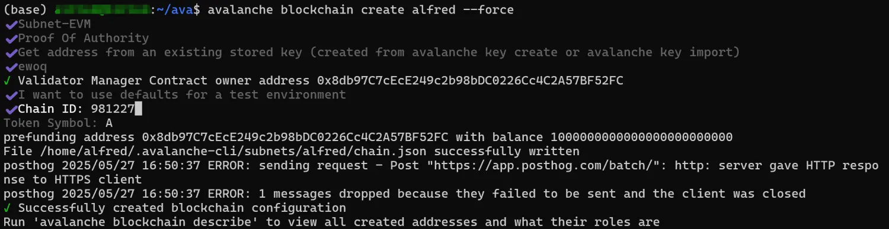
9、部署L1，选择本地网络
```
avalanche blockchain deploy alfred
```
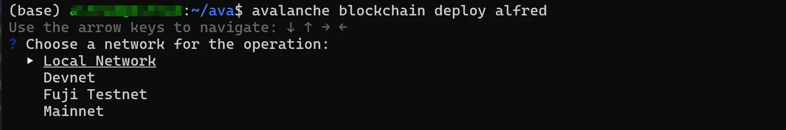
会自动安装avalache的go语言客户端
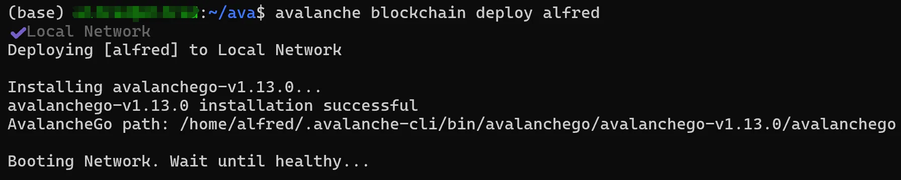
10、部署成功
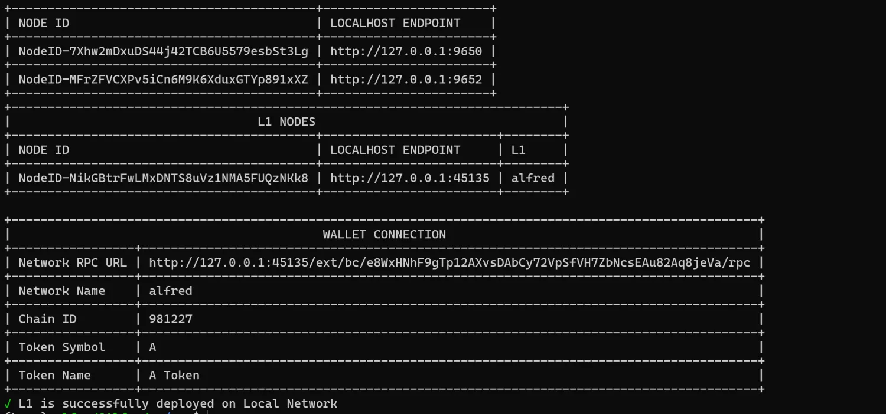
11、Metamask钱包，使用RPC添加本地部署的L1网络
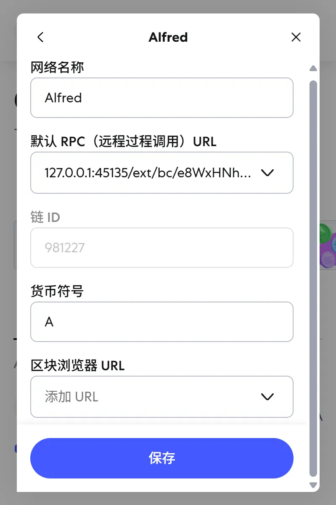
12、使用私钥添加默认创建的钱包
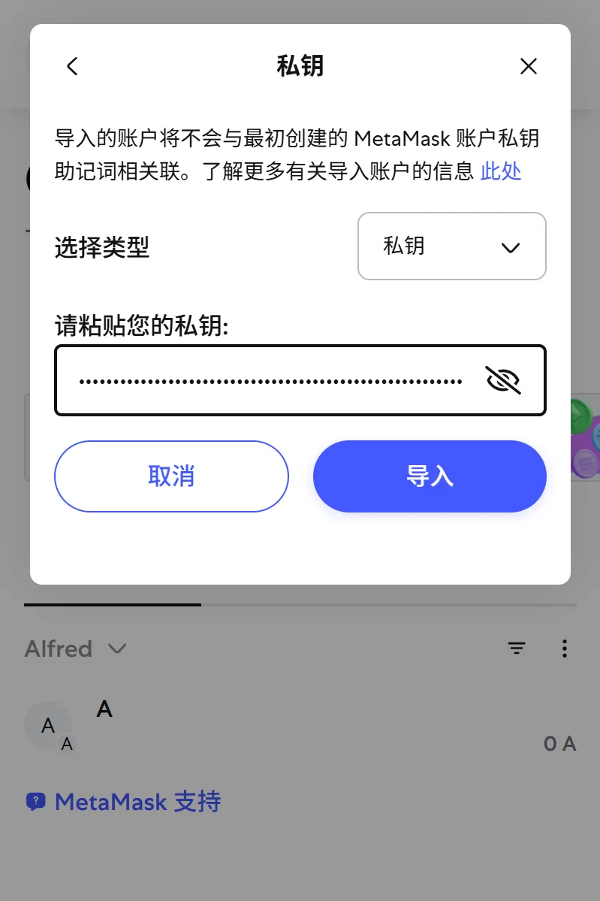
13、添加后就可以看到拥有100W Token的钱包了，可以进行空投或其他后续活动
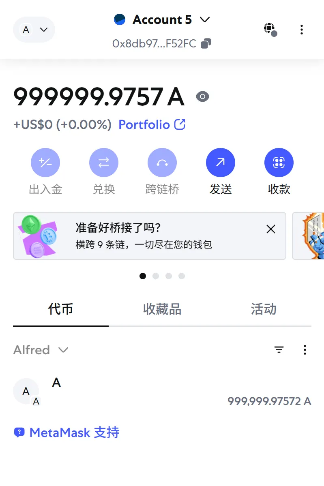